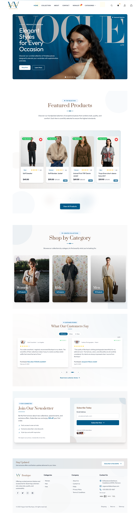
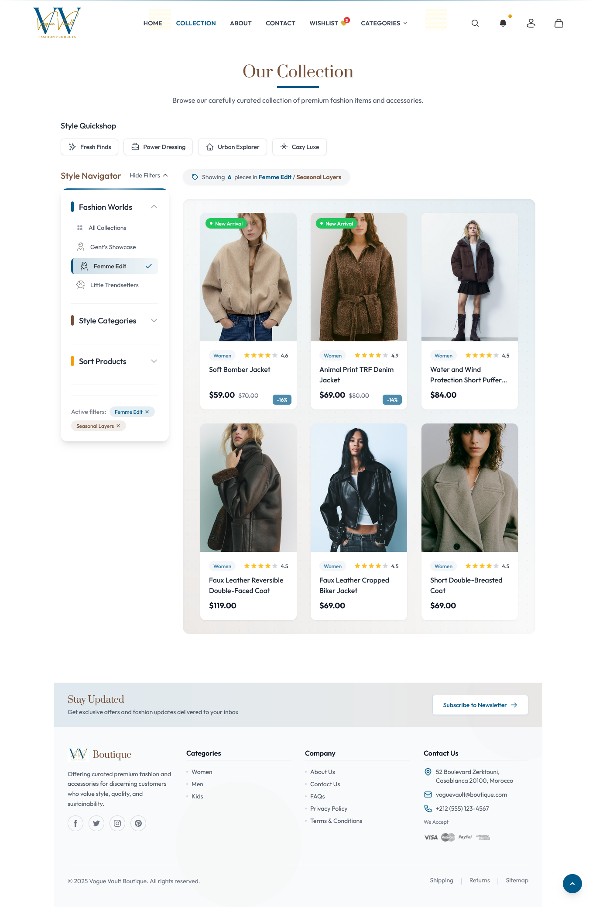
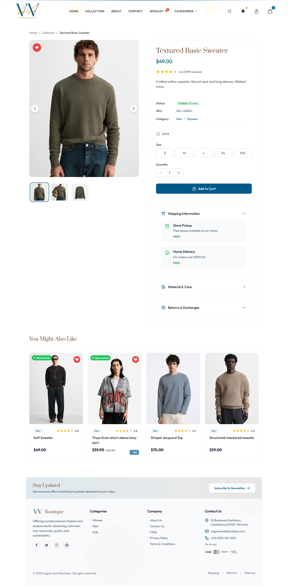
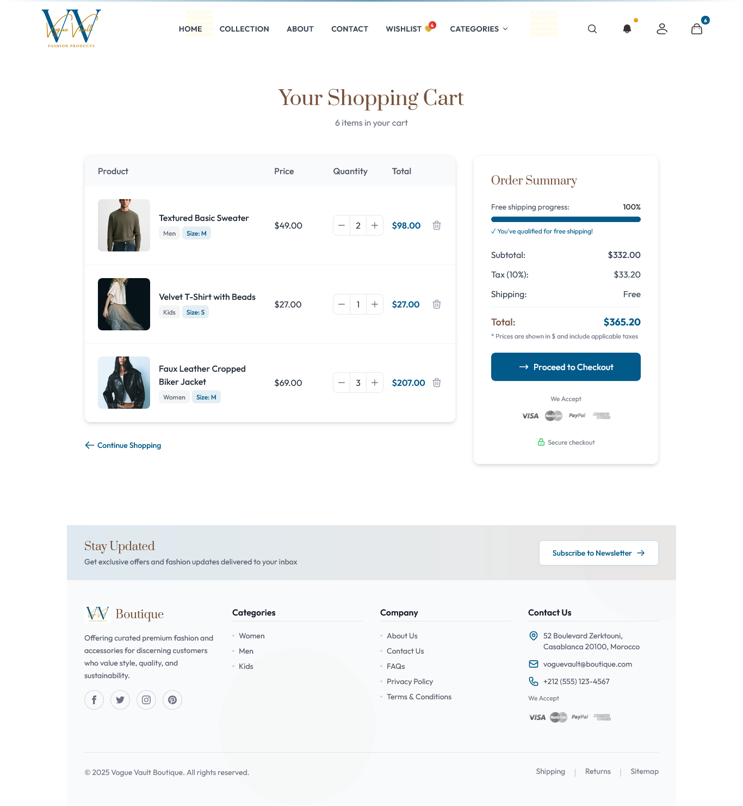
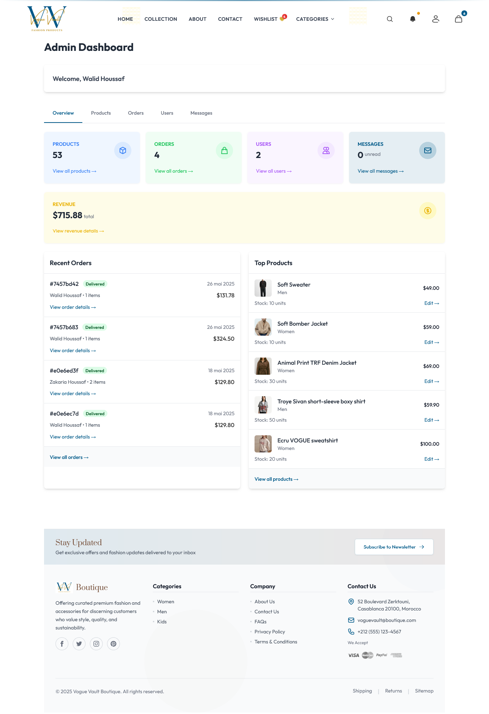

# MERN E-commerce Boutique 🛍️

A modern, full-stack e-commerce application built with the MERN stack (MongoDB, Express.js, React.js, Node.js). This project implements best practices in web development and provides a seamless shopping experience.

## ✨ Features:

### User Features
- 🔐 Secure user authentication and authorization
- 🔍 Advanced product search and filtering
- 🛒 Real-time shopping cart updates
- 💳 Secure payment processing
- 📱 Fully responsive design
- ❤️ Wishlist functionality
- 🔔 Real-time notifications
- 📦 Order tracking

### Admin Features
- 📊 Comprehensive dashboard
- 📝 Product management (CRUD operations)
- 👥 User management
- 📈 Sales analytics
- 🗂️ Category management
- 🏷️ Discount management

## 📸 Screenshots

### Home Page


### Product Collection


### Product Details


### Shopping Cart


### Admin Dashboard


## 🛠️ Technologies Used

### Frontend:
- **React.js** - UI development
- **TailwindCSS** - Styling and responsive design
- **React Router** - Client-side routing
- **Context API** - State management
- **Axios** - HTTP client
- **Framer Motion** - Animations
- **React Toastify** - Notifications

### Backend:
- **Node.js** - Runtime environment
- **Express.js** - Web framework
- **MongoDB** - Database
- **Mongoose** - ODM
- **JWT** - Authentication
- **Bcrypt** - Password hashing
- **Multer** - File uploads

## 🚀 Getting Started

### Prerequisites
- Node.js (v14 or higher)
- MongoDB
- npm or yarn

### Installation

1. Clone the repository:
```bash
git clone https://github.com/YourUsername/Mern-Boutique.git
cd Mern-Boutique
```

2. Install dependencies:
```bash
# Install backend dependencies
cd server
npm install

# Install frontend dependencies
cd ../client
npm install
```

3. Environment Setup:
Create a `.env` file in the server directory:
```env
MONGODB_URI=your_mongodb_uri
JWT_SECRET=your_jwt_secret
PORT=5000
NODE_ENV=development
CLOUDINARY_CLOUD_NAME=your_cloudinary_name
CLOUDINARY_API_KEY=your_cloudinary_key
CLOUDINARY_API_SECRET=your_cloudinary_secret
```

4. Start Development Servers:
```bash
# Start backend server (from server directory)
npm run dev

# Start frontend server (from client directory)
npm start
```

The application will be available at `http://localhost:3000`

## 📝 Usage:

### User Account
- Create an account or login
- Browse products by category
- Add items to cart
- Manage wishlist
- Place orders
- Track order status

### Admin Account
Default admin credentials:
- Email: admin@example.com
- Password: admin123

Admin capabilities:
- Manage products
- Process orders
- View analytics
- Manage users

## 🤝 Contributing:

We welcome contributions! Please follow these steps:

1. Fork the repository
2. Create your feature branch (`git checkout -b feature/AmazingFeature`)
3. Commit your changes (`git commit -m 'Add some AmazingFeature'`)
4. Push to the branch (`git push origin feature/AmazingFeature`)
5. Open a Pull Request

## 📄 License:

This project is licensed under the MIT License - see the [LICENSE](LICENSE) file for details.

## 🙏 Acknowledgments:

- Product images used in this demo are sourced from various e-commerce websites for demonstration purposes only

Project Link: [https://github.com/YourUsername/Mern-Boutique](https://github.com/YourUsername/Mern-Boutique)

---
⭐️ Star this repo if you find it helpful! 